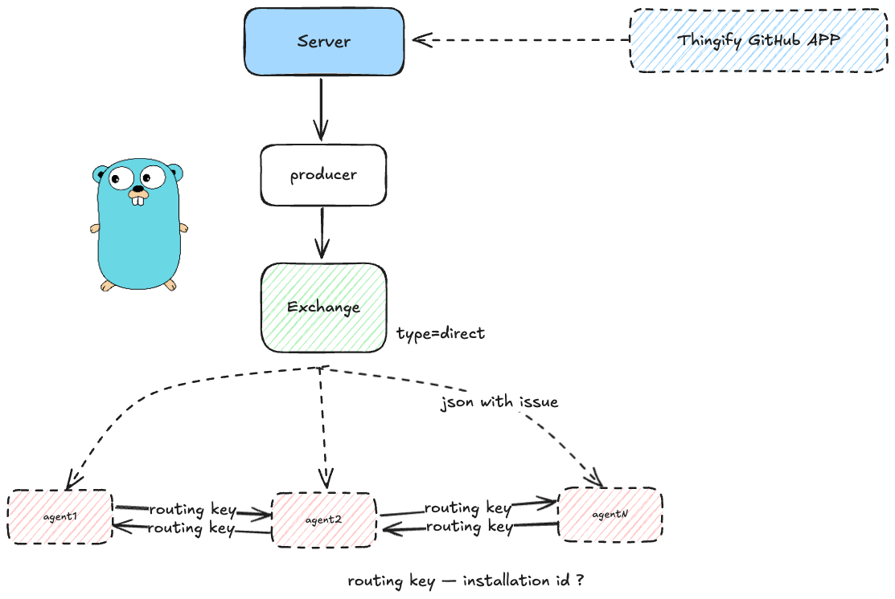
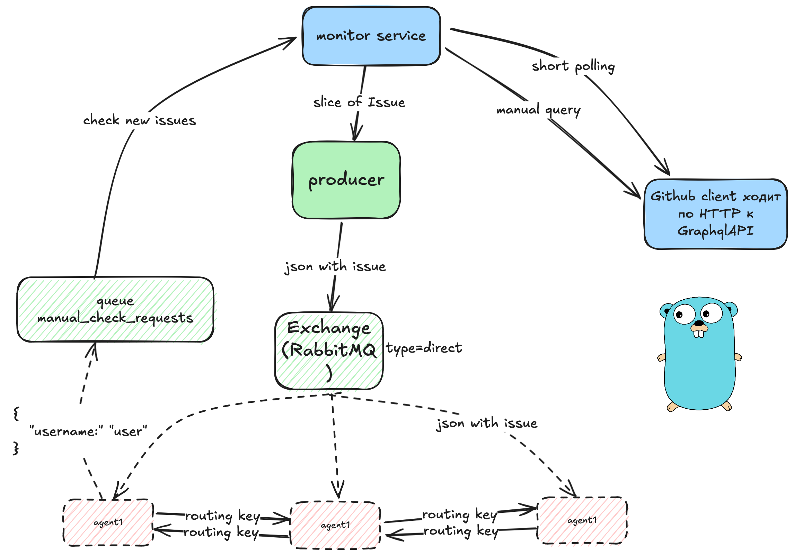

# Thingify

Thingify — это сервис для мониторинга новых задач (issues) пользователя GitHub с Webhook. Доступ к задачам осуществляется через Github APP.

## Возможности

- Получение задач пользователя через GitHub APP Webhook
- Сохранение задач в in-memory хранилище
- Логирование новых задач
- Гибкая настройка через YAML-конфиг и переменные окружения
- Отправлять задачи агенту через брокер сообщений (RabbitMQ)

## Архитектура



<!--  -->

- **cmd/main.go** — точка входа, инициализация приложения, логгера и graceful shutdown
- **internal/app** — сборка зависимостей и запуск серверной части
- **internal/service/monitor** — сервис мониторинга новых задач
- **internal/github** — клиент для работы с GitHub API
- **internal/storage/inmemory** — простое in-memory хранилище задач
- **internal/converter** — преобразование моделей GitHub в доменные модели приложения
- **internal/config** — загрузка и валидация конфигурации

## Быстрый старт (локальная разработка)

1. Установите зависимости:

    ```sh
    go mod download
    ```

<!-- TODO: блок про получение githbu token -->

2. Создайте файл `.env` на основе `.env.example`

3. Запустите приложение:
    ```sh
    docker-compose -f docker-compose.dev.yml up -d --build
    go run ./cmd/main.go -config=./configs/local.yml
    ```
    или через Taskfile:
    ```sh
    task up
    task run
    ```

## Настройка

- Конфигурация по умолчанию находится в `configs/local.yml`
- Переменные окружения можно переопределять через `.env` файл
